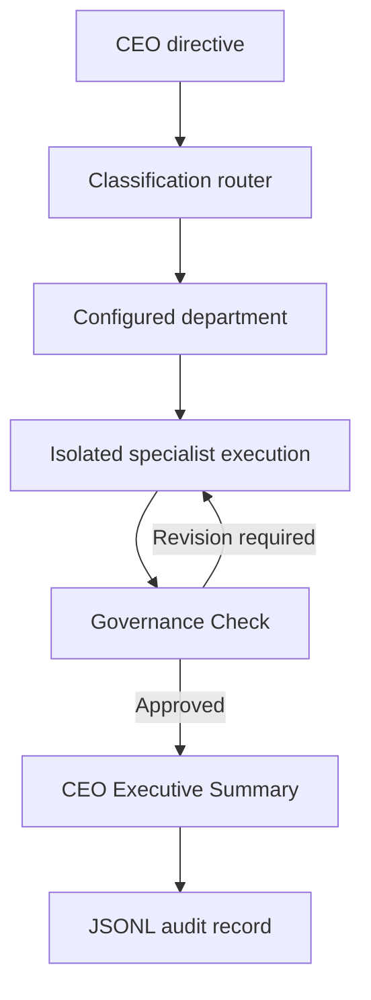

 Mission Control OS™

> **Most AI systems begin with agents. Mission Control OS™ began with governance.**

Mission Control OS™ is a governance-first AI executive operating system for founders and knowledge-driven organizations. It transforms executive directives, conversations, meetings, and organizational knowledge into coordinated, decision-ready intelligence.

**Built for leverage. Not busywork.**

[View the public project experience](https://mission-control-os.cjmoneyway.chatgpt.site)

## Inspiration

Mission Control OS™ grew from a challenge I experience every day as founder and CEO of CJ Moneyway Media™. Founders and small organizations constantly move between strategy, operations, marketing, research, publishing, relationships, and execution. Important decisions become scattered across conversations, documents, meeting notes, and disconnected AI tools.

I wanted to answer a different question:

> **What if AI could prepare an organization for its people instead of replacing them?**

The project applies AI to organizational preparation: documenting departments, routing work, preserving knowledge, supporting executive review, and giving future employees an established operating environment.

## What it does

Mission Control OS™ organizes work through specialized executive and departmental roles rather than one general-purpose assistant. The prototype architecture is designed to:

1. Receive an executive directive.
2. Classify the request.
3. Select the appropriate department or specialist.
4. Execute inside a defined specialist context.
5. Prepare a CEO Executive Summary.
6. Preserve an execution record.
7. Surface the next decision or action.

Potential outputs include CEO Executive Summaries, leadership insights, Moneyway Journal™ executive articles, content-repurposing opportunities, relationship intelligence, follow-up recommendations, partnership opportunities, operational action plans, and searchable organizational knowledge.

## Governance-first architecture

| Layer | Purpose |
|---|---|
| **1. Philosophy** | Mission, values, brand identity, and fixed organizational principles |
| **2. Governance** | Decision filters, escalation, reporting, brand alignment, knowledge preservation, and human review |
| **3. Intelligence** | Classification, departmental routing, specialist contexts, executive summarization, and revision handling |
| **4. Execution** | Articles, reports, recommendations, relationship intelligence, logs, and human-assigned work |

## Primary demonstration

The primary Build Week workflow shows how a podcast conversation can become enterprise intelligence. A source conversation can support:

- A Moneyway Journal™ executive article
- Podcast release materials
- Leadership insights
- Content-repurposing opportunities
- Relationship and follow-up intelligence
- Partnership opportunities
- Operational recommendations
- A CEO Executive Summary
- A principle preserved for the Moneyway Principle Archive™

> **Create Once. Publish Everywhere. Build Forever.™**

## How Codex was used

Codex served as the **technical formalization and implementation layer** for Mission Control OS™. It helped translate founder experience and documented governance into:

- Technical architecture
- Python prototype structures
- Router and specialist workflow logic
- Structured system prompts
- Department-specific instructions
- JSONL audit-log design
- Repository and README documentation
- Capability-status and evidence matrices
- Test and verification requirements
- Devpost submission assets

Codex was also used to separate verified functionality from validation-required and roadmap capabilities so the public submission would not overstate what was operational.

## How GPT-5.6 was used

GPT-5.6 served as a reasoning and organizational-intelligence layer during Build Week. It was used to:

- Interpret executive directives
- Develop and refine governance standards
- Clarify department mandates and boundaries
- Structure executive and specialist roles
- Preserve the founder’s voice across formats
- Generate decision-ready summaries
- Identify cross-department implications
- Refine the Build Week narrative
- Review claims for evidence, privacy, and consistency

The model relationship is:

```text
Founder experience
        ↓
Documented governance
        ↓
GPT-5.6 organizational reasoning
        ↓
Codex technical formalization
        ↓
OpenAI API prototype execution
        ↓
Human leadership and review
```

## OpenAI implementation

- **ChatGPT / GPT-5.6:** Organizational reasoning and governance-development environment
- **Codex:** Technical formalization, implementation support, documentation, and verification structure
- **OpenAI API:** Classification and specialist-execution engine for the prototype
- **Python:** Prototype runtime
- **JSONL:** Structured execution and audit-record format

## Capability status

Mission Control OS™ uses three evidence classifications:

- **BUILT AND VERIFIED** — supported by code, logs, screenshots, tests, a working link, or a recorded demonstration.
- **BUILT — VALIDATION REQUIRED** — present in the implementation or project materials but awaiting complete technical proof.
- **ROADMAP — NOT OPERATIONAL** — designed or planned, but not presented as working.

| Capability | Current classification |
|---|---|
| Public landing page | **BUILT AND VERIFIED** |
| Project narrative and four-layer governance architecture | **BUILT AND VERIFIED** |
| Python prototype | **BUILT AND VERIFIED** |
| Deterministic offline classification and specialist execution | **BUILT AND VERIFIED** |
| OpenAI API classification and specialist execution | **BUILT — VALIDATION REQUIRED** |
| Department routing and isolated specialist contexts | **BUILT AND VERIFIED** |
| CEO Executive Summary generation | **BUILT AND VERIFIED** |
| JSONL audit logging | **BUILT AND VERIFIED** |
| Automated Governance Check and one revision cycle | **BUILT AND VERIFIED** |
| Automated HubSpot, Google Drive, and Google Sheets writeback | **ROADMAP — NOT OPERATIONAL** |
| Full enterprise dashboard and cross-platform synchronization | **ROADMAP — NOT OPERATIONAL** |

## Repository security

Never commit:

- `.env` files
- API keys or access tokens
- Passwords or credentials
- Private CRM exports
- Confidential guest information
- Private email, calendar, Drive, or Sheets data
- Unsanitized execution logs

## System architecture



The default `mock` provider executes this complete path deterministically, without
network access or paid API calls. The optional `openai` provider uses the official
OpenAI Python SDK and the Responses API for classification and specialist execution.
The same deterministic Governance Check and audit layer apply to both providers.

## Requirements

- Python 3.10 or newer
- No API key for the offline demo or tests
- An OpenAI API key only for optional live mode

## Installation

```bash
git clone https://github.com/cjmoneyway-rgb/mission-control-os.git
cd mission-control-os
python -m venv .venv
source .venv/bin/activate
pip install -r requirements.txt
```

Windows PowerShell activation:

```powershell
.venv\Scripts\Activate.ps1
```

The offline prototype itself uses only the Python standard library. Installing
`requirements.txt` adds the official OpenAI SDK for optional live mode.

## Run the judge demo — free and offline

```bash
python main.py --demo
```

This routes the approved Build Week directive to the Media & Editorial Division,
executes the specialist workflow, applies the Governance Check, generates a CEO
Executive Summary, and appends an execution record to `logs/executions.jsonl`.

Run a custom request:

```bash
python main.py "Prepare a podcast guest interview and release plan"
```

Pipe the included sample request and print the complete structured record:

```bash
python main.py --json < examples/sample_request.txt
```

Disable audit logging for an ephemeral run:

```bash
python main.py --demo --no-log
```

## Optional live OpenAI mode

Create an API key at the OpenAI Platform. Never paste it into source code or
commit it to GitHub. Set it in your shell, then select the live provider:

```bash
export OPENAI_API_KEY="your_key_here"
export OPENAI_MODEL="gpt-5.6"
python main.py --demo --provider openai
```

PowerShell:

```powershell
$env:OPENAI_API_KEY="your_key_here"
$env:OPENAI_MODEL="gpt-5.6"
python main.py --demo --provider openai
```

`.env.example` documents the supported variable names. This minimal CLI does
not automatically load dotenv files, which prevents accidental secret loading;
set variables through your shell or an approved secret manager.

## Testing

All automated tests use the deterministic mock provider and make zero API calls:

```bash
python -m unittest discover -s tests -v
```

The suite verifies routing, fallback behavior, Governance Check enforcement,
secret-pattern rejection, JSONL audit logging, CLI execution, and input validation.

## Repository map

```text
mission-control-os/
├── main.py                         # CLI application entry point
├── mission_control/
│   ├── engine.py                   # Route → execute → review → revise → log
│   ├── providers.py                # Mock and OpenAI Responses API providers
│   ├── governance.py               # Deterministic review rules
│   ├── audit.py                    # Append-only JSONL execution records
│   ├── config.py                   # Department configuration loader
│   ├── models.py                   # Typed workflow data contracts
│   └── departments.json            # Governed specialist definitions
├── examples/sample_request.txt     # Approved demonstration directive
└── tests/                           # Offline unit and CLI tests
```

## Current verification boundary

The offline end-to-end prototype is implemented and testable. Live OpenAI mode
is implemented against the Responses API but remains **BUILT — VALIDATION REQUIRED**
until it is run with a user-provided API key. External CRM/Drive/Sheets writeback
and the unified dashboard remain **ROADMAP — NOT OPERATIONAL**.

## What we learned

A multi-agent system needs more than multiple agents. It needs shared principles, defined responsibilities, evidence standards, escalation rules, organizational memory, and human accountability.

> **Mission Control OS™ does not use AI to remove people from the organization. It uses AI to prepare the organization for its people.**

AI prepares.  
People lead.  
Organizations grow.

## Roadmap

- Complete technical validation of the prototype
- Automated governance-review states
- Deeper organizational memory
- Additional executive and departmental specialists
- CRM and relationship-management integration
- Controlled Google Drive and Google Sheets actions
- Human onboarding and department-development tools
- A unified executive dashboard
- Expanded audit and decision-trail capabilities

## Builder

**Corwin “CJ Moneyway” Johnson**  
Founder & CEO, CJ Moneyway Media™  
Host, The CJ Moneyway Show™

- [CJ Moneyway Media™](https://cjmoneyway.com)
- [The CJ Moneyway Show™](https://pod.link/1707761906)
- [LinkedIn](https://www.linkedin.com/in/corwin-johnson-3b7b51aa)
- [Mission Control OS™](https://mission-control-os.cjmoneyway.chatgpt.site)

## Final operating statement

Mission Control OS™ does not replace executive judgment. It creates a governed structure for routing work, applying departmental intelligence, reviewing outputs, preserving institutional memory, onboarding people, and preparing decision-ready information for executive leadership.

**Proceed Brick by Brick™.**  
**Built For Purpose™.**  
**Faith • Vision • Legacy™.**
